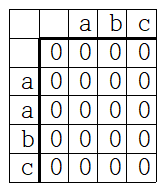
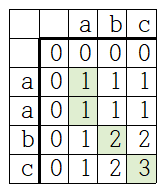
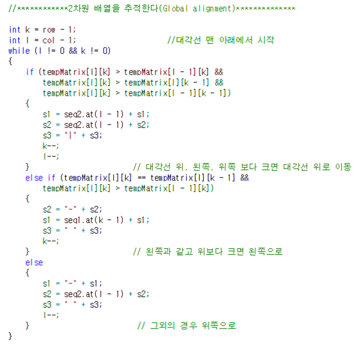
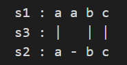
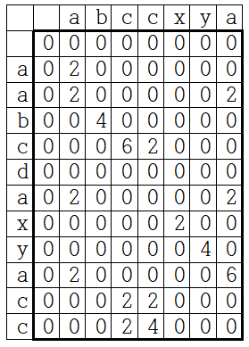
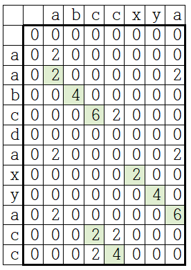

# 구현 알고리즘
두 문자열을 각각 행, 열로 사용한 2차원 배열을 통해 그 유사성을 비교한다.

## 준비
- 비교할 각 문자열을 변수 seq1, seq2에 담는다.
- seq1을 행, seq2을 열로 사용하고 비교값을 저장할 2차원 배열을 만든다. 
- 2차원 배열의 요소를 모두 0으로 초기화한다.

예시) seq1 = "aabc", seq2 = "abc" 일때

## 전역 비교 (Global alignment)

전체 문자열의 유사성을 비교한다.

1)문자가 일치할 경우 +1, 다를 경우 0의 가중치를 두고 2차원 배열을 채운다.

2)2차원 배열을 값을 역추적하며 문자열 s1, s2, s3를 완성한다.

- s1, s2는 비교를 위해 길이가 늘어난('-'가 추가된) 문자열이고, s3는 문자가 일치하는 곳을 '|'로 표시한 문자열이다. 

- 배열 추적 경로에 따라 s1, s2에는 '문자' 또는 '-'를 추가하고, s3에는 ' ' 또는 '|'를 추가한다. 

3)s1, s3, s2를 출력하면 매칭된 부분을 확인할 수 있다. 

출력 :  

## 지역 비교 (Local alignment)

두 문자열에서 지역적으로 유사한 부분을 조사한다.

예시) seq1 = "aabcdaxyacc", seq2 = "abccxya" 일때

1)문자가 일치할 경우 +2, 다를 경우 -6의 가중치를 두고 2차원 배열을 채워나간다. 0보다 값이 작아질 경우에는 0으로 채운다.

2)전역 비교와 마찬가지로 역추적을 수행한다. 예시에서는 최소 2회 이상 연속으로 매칭된 경우, 즉 값이 4 이상인 경우들에 대해서만 역추적을 수행했다

두 문자열에서 'abc', 'xya', 'cc'가 부분적으로 일치함을 확인할 수 있다. 예시의 경우 문자가 일치할때 +2, 불일치 할때 -6의 가중치를 사용하였는데, 이를 조절함에 따라 부분문자열의 일치 하한선을 제어할 수 있다.
